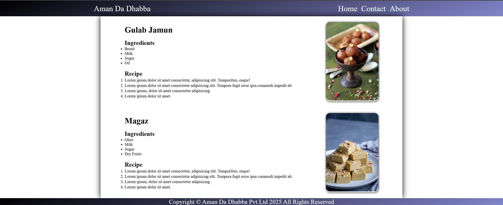

# 🍽️ Aman Da Dhabba - Recipe Project

Welcome to **Aman Da Dhabba**, a simple and elegant web project built using HTML and CSS to showcase delicious Indian recipes such as **Gulab Jamun** and **Magaz**.

## 📸 Preview



---

## 🛠️ Tech Stack

- **HTML5** - For structure
- **CSS3** - For styling and layout

---

## ✨ Features

- 📚 List of Ingredients
- 🧑‍🍳 Step-by-step Recipe Instructions
- 🖼️ Delicious images of each dish
- 🌐 Responsive Header with Navigation
- 📜 Stylish Footer with Copyright

---

## 🧾 Recipes Included

1. **Gulab Jamun**
   - Bread, Milk, Sugar, Oil
2. **Magaz**
   - Ghee, Milk, Sugar, Dry Fruits

---

## 💡 How to Run

1. Clone or download the project
2. Open `index.html` in any modern browser

```bash
git clone https://github.com/your-username/recipe-project.git
cd recipe-project
open index.html  # or just double click the file
